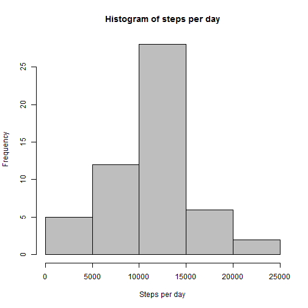
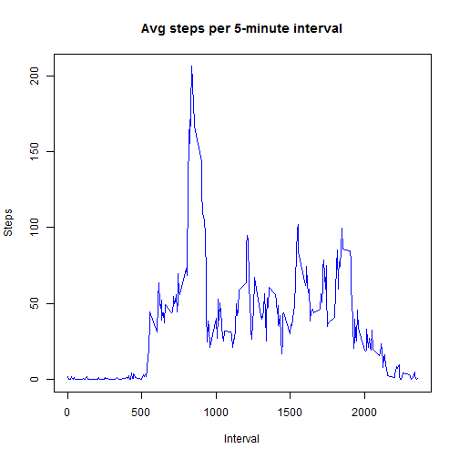
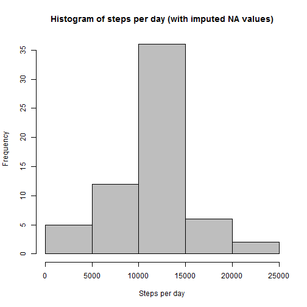
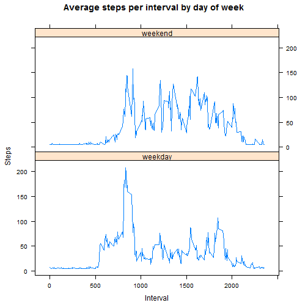

##A. Loading and pre-processing the data
1. Read input csv file into data frame 
2. Create a subset of the previous frame by leaving out NA entries 


```r
myData <- read.csv("activity.csv",header=T, sep=",")
myDataComplete <- subset(myData,complete.cases(myData)==T)
```

##B. Calculate the total number of steps taken per day 
1. Aggregate data by the number of steps and date 
2. Plot histogram of total steps per day
3. Calculate and print the mean and median of total steps per day


```r
#B.1.
stepsPerDay <- aggregate(steps ~ date, myDataComplete, sum)

#B.2.
hist(stepsPerDay$steps, main = "Histogram of steps per day", xlab = "Steps per day", col = "grey")
```

 

```r
#B.3.
meanDailyStep <- mean(stepsPerDay$steps)
meanDailyStep ##print the mean steps per day
```

```
## [1] 10766.19
```

```r
medianDailyStep <- median(stepsPerDay$steps)
medianDailyStep ##print the median steps per day
```

```
## [1] 10765
```

##C. Average daily activity pattern
1. Calculate average number of steps per 5-minute interval
2. Plot a time series of the average number of steps (y-axis) over the 5-minute intervals (x-axis)
3. Calculate and print the interval with the maximum average number of steps


```r
#C.1.
avgStepsPerInterval <- aggregate(steps ~ interval, myDataComplete, mean)

#C.2.
plot(steps ~ interval, avgStepsPerInterval, main = "Avg steps per 5-minute interval", xlab = "Interval", ylab="Steps", type="l", col = "blue")
```

 

```r
#C.3.
maxStepInterval <- avgStepsPerInterval[which.max(avgStepsPerInterval$steps),]
maxStepInterval$interval
```

```
## [1] 835
```

##D. Imputing missing values
1. Calculate & report total number of missing values
2. Impute missing values 
3. Create new data set with missing values filled in
4. Histogram of total steps per day
5. Report the mean and median of total steps per day
6. Impact of imputing missing data


```r
#D.1.
nrow(subset(myData, complete.cases(myData)==FALSE))
```

```
## [1] 2304
```

```r
#D.2. and D.3.
tempData <- myData
tempData$steps[is.na(tempData$steps)] <- mean(tempData$steps, na.rm=TRUE)

#D.4.
stepsPerDayImputed <- aggregate(steps ~ date, tempData, sum)
hist(stepsPerDayImputed$steps, main = "Histogram of steps per day (with imputed NA values)", xlab = "Steps per day", col = "grey")
```

 

```r
#D.5.
mean(stepsPerDayImputed$steps)
```

```
## [1] 10766.19
```

```r
median(stepsPerDayImputed$steps)
```

```
## [1] 10766.19
```

```r
#D.6.
```

The mean and median of the total steps per day in the imputed data set are equal.  

##E.Activity patterns during weekdays and weekends
1. Create a factor variable with 2 levels - "weekday" and "weekend"
2. Create a panel plot of 5-minute interval (x-axis) and avg steps taken, averaged across all weekdays and weekends (y-axes)  


```r
#E.1.
finalData <- tempData
finalData$date <- as.Date(finalData$date)

finalData$dayofweek[(weekdays(finalData$date)=="Saturday" | weekdays(finalData$date)=="Sunday")] <- "weekend"

finalData$dayofweek[!(weekdays(finalData$date)=="Saturday" | weekdays(finalData$date)=="Sunday")] <- "weekday"

finalData$dayofweek <- as.factor(finalData$dayofweek)

#E.2.
stepsPerInterval_DOW <- aggregate(steps ~ interval + dayofweek, finalData, mean)

library(lattice)

xyplot(stepsPerInterval_DOW$steps ~ stepsPerInterval_DOW$interval | stepsPerInterval_DOW$dayofweek, main="Average steps per interval by day of week", xlab="Interval", ylab="Steps", type="l", layout=c(1,2))
```

 

